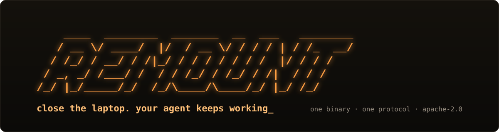

<div align="center">



<h1>Long-running agents on your own machines</h1>

[Quick start](#quick-start) · [Harnesses](#harnesses) · [Why Remount](#why-remount) · [Docs](docs/using-remount.md) · [Protocol](spec/PROTOCOL.md) · [Website](https://remount.dev)

[](https://github.com/andrewgcodes/remount/actions/workflows/ci.yml)
[](go.mod)
[](https://pkg.go.dev/remount.dev/remount)
[](LICENSE)

</div>

Remount is a self-hosted runtime for AI agents that need to keep working after
you close the laptop. It runs [Claude Code](https://github.com/anthropics/claude-code),
[Codex](https://github.com/openai/codex), [OpenCode](https://github.com/sst/opencode),
[Pi](https://github.com/earendil-works/pi), [Gemini CLI](https://github.com/google-gemini/gemini-cli),
[Aider](https://github.com/Aider-AI/aider), [Goose](https://github.com/block/goose),
[Cline](https://github.com/cline/cline), [OpenHands](https://github.com/All-Hands-AI/OpenHands)
or any agent loop you wrote, as background agents in workspaces that snapshot,
move between machines, sleep, wake on events, and never hold an API key. One
static Go binary, one open protocol, Apache-2.0, nothing hosted.

- **Hand off a live conversation.** `remount handoff` copies your checkout and
  the harness's saved conversation into a workspace and keeps going there;
  `remount resume` reopens that exact conversation from any machine.
- **Run agents overnight.** A task queue runs in one workspace, sleeps on a
  control-plane timer between tasks and continues on whichever node wakes it.
  A durable Agent sleeps when idle, wakes on a message or a merged PR, forks
  children, and parks for approval before an egress you marked sensitive.
- **Never lose output.** Sessions belong to the node. Close the terminal,
  come back, `attach`, and the output replays from where you left off.
- **Move mid-task.** `ws move` snapshots the filesystem and a node in the zone
  you asked for restores it; files and policy follow.
- **Keys the agent never sees.** The workspace holds a placeholder; the
  node's broker substitutes the real credential only for allowed hosts, audits
  every use, and a revocation reaches a live workspace within one renewal.
- **A browser in the workspace.** Navigate, screenshot, click, type, download
  files that become artifacts, under the same egress policy as everything
  else.
- **Isolation you can check.** A node declares a runtime profile and refuses
  to start unless its backends can prove it; `remount conformance --profile`
  gives a reviewer a report where every check is pass, fail or unavailable.
- **Go, Python and TypeScript SDKs**, a CLI, and an MCP server, with the same
  typed errors everywhere.

## Introduction

An agent runtime is the machine an agent works on, plus whatever keeps that
work alive when you are not looking. You use it to start an agent on a task,
walk away, and find the work still going, or paused exactly where it stopped,
with a record of everything it did.

Most sandboxes tie the agent's work to one container and one connection: when
either goes away, so does the work. Remount separates the two things that
usually get fused. The **workspace** (files, processes, policy) is separate
from the **machine** that happens to run it, so it can be snapshotted and
restored somewhere else. The **session** (a command and its output) is
separate from the **socket** carrying it, so a client can disconnect and
reattach without losing a byte. Everything that decides what happens next,
from credentials to deadlines, lives in a small control plane rather than in
the workspace or in your process.

## What it's for

- **You, with a coding agent and a laptop.** You started Claude Code or Codex
  on a refactor and need to leave. `remount handoff` moves the conversation
  and the checkout to a cloud machine; the agent keeps going; `remount resume`
  opens the same conversation from wherever you are tomorrow. A task queue
  runs your backlog overnight on a durable timer.
- **A team shipping an agent product.** Every customer's agent is a durable
  Agent resource with a transcript, a sleep and wake policy, approvals for
  sensitive egress, and children it can fork. Provider keys are bound once
  and brokered at the node; the workspace never sees them and revocation is a
  single call. Every action lands in an event log you can stream to
  customers or auditors.
- **A platform team hosting other people's agents.** Nodes declare a runtime
  profile and refuse to start unless they can prove it. gVisor and Firecracker
  backends enforce deny-first egress and sibling isolation. `remount
  conformance --profile` produces the evidence a security review wants, and
  quotas, leases and idle policy bound what any tenant can hold.
- **Anything that needs a browser, a shell and time.** Research agents,
  data-collection agents, operations agents: a workspace with a browser,
  files that become artifacts, egress policy on every request, and a deadline
  that outlives the process that started it.

## Quick start

```sh
go install remount.dev/remount/cmd/remount@main    # or: git clone && make build
```

Everything below runs on your laptop with no account, token or API key.

```sh
remount standalone --data ./data &                 # control plane and one node
export REMOUNT_SERVER=http://127.0.0.1:7443

WS=$(remount ws create --name hello)
remount exec $WS -- sh -c 'echo hello from $(hostname)'
remount sh $WS                                     # interactive shell, real pty
```

Start something long, press Ctrl-C, and pick it up again later:

```sh
remount exec $WS -- sh -c 'for i in $(seq 1 100); do echo line $i; sleep 1; done'
remount ws ls
remount attach $WS <session-id> --from 0
```

With a provider key in your environment, one command runs a coding agent
against a key it never sees; `remount run` starts the standalone for you if
nothing is listening:

```sh
export ANTHROPIC_API_KEY=...
remount run claude --dir . -- 'add integration tests for the payments module'
```

Hand that conversation to a cloud machine and leave, then resume it tomorrow
from anywhere:

```sh
remount handoff --recipe claude --binding b_anthropic --task 'finish the refactor and open a PR'
remount resume $WS
```

Run a queue of tasks overnight, sleeping between them on a durable timer, and
wake a workspace when the PR merges:

```sh
remount run codex --queue tasks.txt --sleep-after 30m
remount ws sleep $WS --on github.pr.merged
```

Create a durable Agent that pauses when idle, asks before risky egress, and
forks a helper:

```sh
AGENT=$(remount agent create opencode --dir . --sleep-after 10m --approve on-request --detach -- 'migrate to pnpm')
remount agent watch $AGENT
remount agent fork $AGENT -- 'update the docs to match'
```

The guided version of all of this is [docs/tutorial.md](docs/tutorial.md).
Deploying a real control plane and nodes is [docs/operations.md](docs/operations.md).

## Harnesses

A recipe is a small YAML file embedded in the binary; adding a harness is a
YAML pull request, not Go. `remount run RECIPE`, `remount agent create RECIPE`
and `remount handoff --recipe RECIPE` all take these:

| Recipe | Harness | Auth | Conversation travels on hand-off |
|---|---|---|---|
| `claude` | [Claude Code](https://github.com/anthropics/claude-code) | key or login | yes, by transcript id |
| `codex` | [Codex CLI](https://github.com/openai/codex) | key or login | yes, by transcript id |
| `opencode` | [OpenCode](https://github.com/sst/opencode) | key or login | state directory |
| `pi` | [Pi](https://github.com/earendil-works/pi) | key | state directory |
| `gemini` | [Gemini CLI](https://github.com/google-gemini/gemini-cli) | key or login | state directory |
| `aider` | [Aider](https://github.com/Aider-AI/aider) | key | state directory |
| `goose` | [Goose](https://github.com/block/goose) | key | state directory |
| `cline` | [Cline](https://github.com/cline/cline) | key or login | state directory |
| `openhands` | [OpenHands](https://github.com/All-Hands-AI/OpenHands) | key | state directory |
| `custom` | anything after `--` | key or login | none |

Provider keys become brokered bindings through presets (OpenAI, Anthropic,
Google, OpenRouter, Groq, DeepSeek, xAI, Mistral, Together, Fireworks,
Bedrock, Vertex, Azure OpenAI). The full table, including sandbox modes and
what state each harness carries, is in
[docs/harness-integration.md](docs/harness-integration.md).

## Why Remount

Sandbox APIs give you a container in someone else's cloud for the length of a
request. Remount is built for agents whose work lasts longer than a request
and longer than the process that started it.

| | Remount | Hosted sandbox APIs (E2B, Daytona, Modal) | Coder | OpenSandbox |
|---|---|---|---|---|
| Runs on | your machines, or Modal, Fly, Kubernetes | their cloud | your infrastructure, Terraform-defined | your Docker or Kubernetes |
| Shape | one static binary, one protocol | SDK over an HTTP API | server plus PostgreSQL, Wireguard tunnels | multi-component platform, Python server |
| Session output | replayable log; reattach after a disconnect | request/response | terminal in the workspace | request/response |
| Workspace lifecycle | snapshot, move between machines, sleep, wake on events, durable leases | per-sandbox timeouts, snapshots on some | idle shutdown | per-sandbox timeouts |
| Live harness hand-off and resume | yes, by transcript id for Claude Code and Codex | no | no | no |
| Credentials | brokered at the node; workspace holds a placeholder; revocable | API key in the sandbox, or a vault on some | no LLM keys in workspaces, gateway | credential vault |
| Isolation | process, Docker, gVisor, Firecracker; profiles verified at node start; conformance judge | provider-managed | your infrastructure | gVisor, Kata, Firecracker |
| License | Apache-2.0 | proprietary service | AGPL-3.0 with premium | Apache-2.0 |

Every row about Remount is backed by a test or a recorded live run in
[docs/engineering/](docs/engineering/); the other columns are from those
projects' own READMEs and may lag.

Some of this borrows from tools you already know: sessions that survive a
dropped connection, as in tmux and mosh; a claim queue with leases and
generation fencing, as in Kubernetes; microVM and syscall-filtered isolation
from Firecracker and gVisor; secrets substituted at a proxy rather than handed
to the workload. The ideas Remount adds on top have names, because they show
up everywhere in the protocol:

- **Sessions are logs.** Every session's output is an append-only log with
  sequence numbers, and a client reads from an offset. Reconnecting is a
  read, not a reconnection; a range that retention dropped is an explicit
  gap, never silence.
- **The workspace is a value.** It has a generation. Snapshot, move, sleep
  and wake produce a new generation, and every grant a client holds is bound
  to one, so a stale client cannot act on a workspace that has moved.
- **Secret-blind execution.** The workspace holds placeholders. The node's
  broker swaps them for real credentials only on requests to the hosts a
  binding allows, and records who used which credential where.
- **Lifecycle belongs to the control plane.** Sleep, wake, leases and idle
  policy are durable timers that survive the client, the node and a
  control-plane restart.
- **Runtime profiles fail closed.** A node claims a profile at startup and is
  refused unless its backends can prove it; a check that cannot run is
  reported unavailable, never healthy.
- **Hand-off of a live conversation.** A harness's saved transcript is a
  first-class thing that travels with the checkout and resumes by id.
- **Everything is an event**, committed in the same transaction as the state
  it describes.

## How it fits together

```
   your laptop                  control plane                 a GPU box
  ┌────────────┐   outbound    ┌──────────────┐   outbound   ┌────────────┐
  │  remount   │──────────────▶│  claim queue │◀─────────────│  remount   │
  │    up      │   wss:443     │  event log   │   wss:443    │    up      │
  └────────────┘               │  policy      │              └────────────┘
                               │  bindings    │
  ┌────────────┐               └──────────────┘
  │  remount   │──────────────────────▲
  │  exec/sh   │   frames relayed, never interpreted
  └────────────┘
```

Every machine that runs workspaces is a node. Nodes and clients both dial the
control plane, so nothing needs a public inbound port. The control plane owns
the queue of workspaces waiting for a node, the event log, policy and
credential bindings; session traffic passes through it as opaque frames. The
same binary is the server, the node and the client.

## SDKs

Go:

```go
import (
    "remount.dev/remount/api"
    "remount.dev/remount/client"
)

c, err := client.New(client.Options{Server: "https://remount.example", Token: os.Getenv("REMOUNT_TOKEN")})
ws, err := c.CreateWorkspace(ctx, api.WorkspaceSpec{Name: "agent"})
ws, err = c.WaitClaimed(ctx, ws.ID)
stdout, stderr, exit, err := c.Run(ctx, ws.ID, "sh", "-c", "make test")
if api.Is(err, api.CodeDenied, api.ReasonEgressDenied) { /* bind a credential for that host */ }
```

Python (`pip install ./sdk/python` until the first release is published):

```python
from remount import Client

async with Client("https://remount.example", token=os.environ["REMOUNT_TOKEN"]) as remount:
    ws = await remount.create_workspace({"name": "agent"})
    session = await remount.exec(ws["id"], ["sh", "-c", "make test"])
```

TypeScript (`npm install ./sdk/typescript` until the first release is published):

```ts
import { Client } from "@remount/sdk";

const remount = new Client("https://remount.example", process.env.REMOUNT_TOKEN!);
const ws = await remount.createWorkspace({ name: "agent" });
const session = await remount.exec(ws.id, ["sh", "-c", "make test"]);
```

Errors carry a stable `code` and `reason` in all three languages, and Python
and TypeScript raise one class per reason. There is also an
[MCP server](docs/mcp.md) that exposes workspaces to any MCP client, and an
[agent HTTP API](docs/api.md) for building products on top.

## Deploying it

`remount standalone` is for one machine. For a fleet, run `remount server`
somewhere reachable, enroll nodes with `remount node enroll` and
`remount up --enrollment-file`, and choose a runtime profile per node:

```sh
remount up --server https://your-server --profile multi-tenant-isolated --label zone=gpu
remount doctor --profile multi-tenant-isolated
remount conformance --profile multi-tenant-isolated --markdown review.md
```

Reference deployments for Docker Compose, Helm, Modal and Fly are under
[deploy/](deploy/). Which backend satisfies which profile on which operating
system is the generated [support matrix](docs/security-profiles.md).

## Documentation

- [docs/using-remount.md](docs/using-remount.md): using a deployment, from a first workspace to a moved one.
- [docs/harness-integration.md](docs/harness-integration.md): every recipe, hand-off, resume, queues, and writing your own loop.
- [docs/tutorial.md](docs/tutorial.md): a guided walkthrough.
- [docs/design.md](docs/design.md): data model, failure model, threat model, performance budget.
- [spec/PROTOCOL.md](spec/PROTOCOL.md): the wire protocol.
- [docs/adr/](docs/adr/README.md): every design decision, indexed by number.
- [docs/credentials.md](docs/credentials.md): bindings, substitution, rotation, revocation, session principals, audit.
- [docs/operations.md](docs/operations.md): deploying, hardening and running it for real.
- [docs/security-profiles.md](docs/security-profiles.md): the support matrix by operating system, backend and runtime profile.
- [docs/observability.md](docs/observability.md): status, inspect, doctor, metrics, traces.
- [docs/api.md](docs/api.md), [docs/mcp.md](docs/mcp.md), [docs/console.md](docs/console.md), [docs/images.md](docs/images.md), [docs/compatibility-policy.md](docs/compatibility-policy.md), [docs/releases.md](docs/releases.md), [docs/benchmarks.md](docs/benchmarks.md), [CHANGELOG.md](CHANGELOG.md).
- [docs/engineering/](docs/engineering/): dated audits, verification evidence, and the notes kept while building it, including [MISTAKES.md](MISTAKES.md).

## Repository layout

| Directory | What it holds |
|---|---|
| `cmd/remount` | the binary: server, node, standalone and the CLI |
| `api/`, `client/` | the public Go packages |
| `sdk/python`, `sdk/typescript` | the Python and TypeScript clients |
| `internal/` | control plane, node, session log, broker, backends, simulator |
| `spec/` | the wire protocol and its JSON Schema |
| `examples/` | runnable programs against the public packages only |
| `images/` | the default workspace image and the browser image |
| `deploy/` | Compose, Helm, Modal, Fly, and the static site behind remount.dev |
| `web/` | the embedded operator console |
| `docs/` | everything above, plus one ADR per decision |

## Status

Everything in this README is implemented and tested, including under the race
detector and in a one-process simulator with fault injection. The rows marked
live were also exercised against real servers, real providers and a real
browser; the runs are in [the verification ledger](docs/engineering/verification-2026-09.md).

| Area | Status |
|---|---|
| Exec and pty sessions with replayable reconnect | ✅ |
| Snapshots, cross-node move, sleep and wake on timers and events | ✅ |
| Durable leases and idle policy in the control plane | ✅ live |
| Brokered credentials with runtime create, rotate and revoke | ✅ live, real OpenAI and Anthropic |
| Hand-off and resume of Claude Code and Codex conversations | ✅ |
| Durable Agents: transcripts, approvals, fork, task queues | ✅ |
| Computer sessions with brokered browsing | ✅ live, Chromium in Docker |
| Runtime profiles, drift detection, `doctor` and `conformance --profile` | ✅ live, gVisor passed `multi-tenant-isolated` |
| Firecracker `microvm` profile | ⚠️ backend implemented; no live profile pass yet |
| Go, Python and TypeScript SDKs with typed errors | ✅ |
| OpenTelemetry traces, Prometheus metrics, operator console | ✅ |
| Tagged release and published packages | ❌ not yet; install with `go install` or from source |
| Apple Virtualization, peer-to-peer transport, a hosted service | ❌ not planned |

Two limits to plan around: moving a workspace moves files and policy, not
running processes (harnesses resume from their own saved state), and a
browser profile does not survive a sleep or a move, on purpose.

## Contributing and security

Read [CONTRIBUTING.md](CONTRIBUTING.md) and [AGENTS.md](AGENTS.md) before a
change; `make verify` runs every CI gate locally. Report vulnerabilities
through [SECURITY.md](SECURITY.md), never in a public issue.

## License

Apache-2.0. Implement the protocol however you like; replace this
implementation if you can do better.
