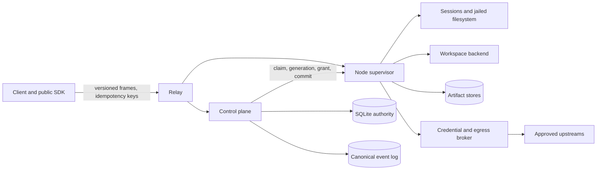
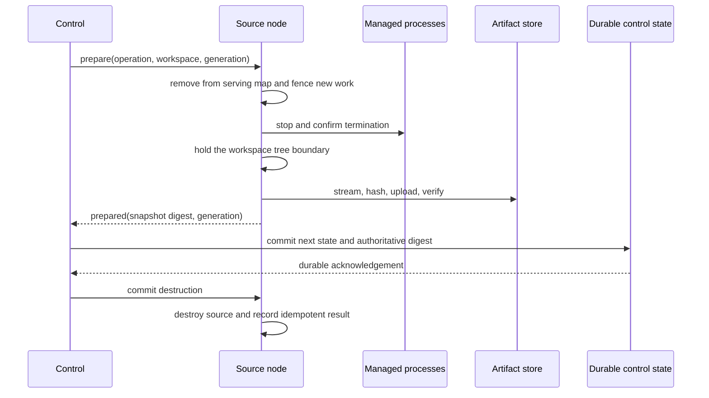

# Remount hardening lessons and review playbook

This is the living synthesis of what the implementation audits, fixes, race
investigations, local exercises, and E2B/Modal deployments taught us. It is
deliberately different from the other documents in this directory:

- the [implementation closure](./implementation-closure-2026-09-03.md) is the
  point-in-time disposition and evidence ledger;
- [MISTAKES.md](../../MISTAKES.md) is the chronological incident history;
- the ADRs record stable architectural decisions; and
- this document turns the repeated failure patterns into a method for changing
  and reviewing Remount safely.

This guide is not itself proof that a release is production-ready. Re-run the
appropriate checks against the exact candidate and target backend. The closure
document's residual-risk register remains the current limit on product claims.

## The shortest useful mental model

Remount is an authority-transfer system wrapped around an agent computer.
Remote execution is visible at the surface, but the hard problem is preserving
one truthful answer to each of these questions during retries, disconnects,
crashes, and moves:

1. Which node, generation, and authorization revision may act?
2. Which filesystem copy is authoritative and safe to destroy?
3. Which session bytes have been produced, retained, delivered, or evicted?
4. Which credential use and egress decision was actually permitted?
5. Which durable record and event prove that the transition committed?



The relay routes. The control plane owns assignment authority. The node owns
the local resource while its lease and generation remain valid. The backend
owns the execution boundary it honestly advertises. Artifact bytes are useful
only after their digest and authoritative reference commit. Events explain
what happened, but resource rows are recovery truth.

## Never use a convenient proxy for the authoritative fact

Many serious bugs were an adjacent fact being treated as the real fact.

| Convenient proxy | Authoritative fact |
|---|---|
| A node won a claim | The node finished materialization and `ws.ready` committed `claimed` |
| A socket is connected | The peer has current identity, generation, and authorization |
| A request was authorized | It is still serviceable after acquiring the resource lock |
| Archive production returned an ID | The digest was verified and control committed the authoritative reference |
| A cancellation was sent | The producer or process exited and was joined |
| `Session.Wait` returned | Manager accounting was already updated and capacity is reusable |
| The HTTP listener answered | The colocated node enrolled and an authenticated Remount operation worked |
| A smoke function ran | It targeted the named deployed service, not an ephemeral copy |
| A diagnostic skipped a check | The result is incomplete, not healthy |
| A command exited zero | The intended postcondition is present |

When reviewing code, ask which side of this table it is using.

## Lesson 1: encode ordering instead of hoping for it

Network delivery, goroutine scheduling, and process exit do not preserve the
order suggested by source code.

The initial session bug was a perfect example: the node subscribed the client
before returning the open response, so sequence zero could arrive before the
client knew the session ID. The durable fix was an orphan buffer plus ordered
registration, not a delay. The ready-handshake bug was the same shape at a
larger scale: winning a claim did not mean restore had finished, so
`claiming` and `ws.ready` made the dependency explicit.

Use one of these mechanisms whenever correctness depends on order:

- a state transition with an allowed predecessor;
- a bounded buffer keyed by sequence;
- a reservation made before starting duplicate-prone work;
- a generation, authorization revision, operation ID, or producer sequence;
- a channel or join that proves completion; or
- a durable prepare/commit protocol.

Do not use sleeps to establish order. A sleep can make one schedule likely; it
cannot make the forbidden schedule impossible.

## Lesson 2: destructive lifecycle work needs a durable commit point

Move, sleep, release, destroy, and fleet quarantine can erase the only usable
copy of a workspace. They therefore use a two-phase shape:



The source is retained and fenced if quiescence, snapshotting, upload,
persistence, or acknowledgement fails. A response timeout is ambiguous; it is
not permission to delete. Replays use the operation ID and generation to return
the durable result rather than repeat the side effect.

The archive-to-control-commit interval is part of the snapshot boundary. If a
write can enter after tar reaches EOF but before control stores the digest, the
checkpoint no longer represents the state acknowledged to the caller. Hold the
tree boundary through that commit.

## Lesson 3: authorization must survive the wait to use the resource

An authorization check protects only the instant at which it runs. A request
can pass grant validation, wait behind a lifecycle writer, and then wake after
release, quarantine, fencing, or checkpoint changed the workspace.

Node operations therefore:

1. validate the grant and locate the workspace;
2. acquire the workspace tree lock;
3. revalidate that the same handle is still in the serving map at the expected
   generation; and
4. only then touch the filesystem, start a session, or commit a checkpoint.

Closing a handle follows the inverse rule: remove it from service, take the
exclusive boundary to drain in-flight work, stop managed sessions, close the
filesystem, and only then release or destroy the backend resource.

This is a general TOCTOU rule: checking identity or policy before a blocking
operation is insufficient unless the protected object cannot change while the
caller waits.

## Lesson 4: cancellation is a request, joining is evidence

A failed bounded snapshot once closed its pipe and returned while the archive
producer goroutine could still be walking the filesystem. The caller released
the tree lock, creating a race between stale archive work and the next
lifecycle operation.

The fix closes the pipe to wake the producer and then waits for
`producerDone` before returning. The same principle applies to process
termination, session output pumps, reconnect supervisors, background commits,
and cleanup:

- signal cancellation;
- close the resource that can unblock I/O;
- wait for the worker to finish;
- propagate its terminal error; and
- only then publish completion or release its lock/capacity.

If code starts a goroutine inside a critical lifecycle operation, the review
must identify who joins it on every success and failure path.

## Lesson 5: idempotency is scoped, durable, and argument-sensitive

An idempotency key is not a global permission to return an earlier result.
Remount scopes mutating calls to authenticated subject, tenant, workspace, and
operation, stores the intent before the effect, and stores the terminal result
before acknowledging it. Reusing a key with different arguments is a conflict.

The mutation journal deliberately does not reapply an ambiguous pending
mutation after restart. Repeating a file append could be worse than returning
an explicit uncertain result. Capacity checks must also recognize a replay at
the limit; an already-admitted operation should remain replayable even when no
new operations may enter.

Session input has the same rule at byte-stream scale. A sequence advances only
after every byte and requested EOF action succeeds. Advancing it after a short
write would cause a retry to be deduplicated and silently lose the unwritten
suffix.

## Lesson 6: bounded means every stage and every index

It is not enough to bound the final collection. The hardening pass found limits
needed for active and retained sessions, reorder/orphan buffers, request
admission, snapshots, artifacts, connector objects and bytes, workspaces,
events, timers, idempotency records, mutation journals, fleet operations,
assignment history, tombstones, and keyed mutex maps.

For every new long-lived map, queue, file, row set, or goroutine pool, answer:

- What is its unit: entries, bytes, concurrent work, age, or all four?
- Is capacity reserved before staging so concurrent writers cannot overcommit?
- Is an idempotent replay allowed at capacity?
- Which live references prevent collection?
- Can protected oldest rows starve deletable rows behind them?
- Is usage reconstructed after restart?
- What error code, metric, and diagnostic expose exhaustion?
- Are lock keys and other bookkeeping entries removed when their last user
  leaves?

The assignment-retention bug is the subtle version. Selecting the oldest N
rows and skipping protected rows in Go can inspect the same protected prefix
forever. Exclude the live-authority set in SQL before applying the deletion
limit.

## Lesson 7: fail closed at representation and capability boundaries

Workspace generations are unsigned on the wire, while SQLite integers are
signed. Incrementing through the storage boundary could wrap, fail to persist,
or create two interpretations of authority. Generation exhaustion now moves
the workspace to durable failure without wrapping.

The same discipline applies to backend claims. A backend that cannot provide
an enforced network gateway must not advertise enforced egress. The process
backend has no isolation, and the built-in Docker integration is
cooperative-proxy. Production profiles reject both rather than interpreting
best effort as enforcement.

An authoritative checkpoint also fails with `unsupported` before doing work
when there is no control-plane artifact endpoint. Returning a local digest that
cannot become failover state would be a false success.

## Lesson 8: output gaps and unavailable checks are data

The session log is bounded, so old chunks can be evicted. A `gap` frame is
not decoration; it proves the output is incomplete. Public `Copy` and
aggregate `Run` validate the gap, render a marker where possible, and return
a typed `evicted` error. They never concatenate the remaining suffix and call
it complete.

Diagnostics follow the same epistemic rule:

- verified good is healthy;
- verified bad is unhealthy;
- unreachable, unauthorized, timed out, or not attempted is unavailable.

Only the first is a pass. `doctor --deep` and `scripts/explain.py` preserve
that distinction, and automation gets a different exit code for an incomplete
collection.

## Lesson 9: public APIs need an external consumer

An in-module Go test can import `internal` packages that an actual user cannot.
The public `api` and `client` packages are therefore compiled and exercised
from `integration/publicsdk`, a separate module. Run `make public-api` for
every exported API change.

Wire compatibility needs a different proof: exact version negotiation,
capability tests, deterministic encoding, and the golden V1 fixture. Encoding
must not mutate a caller-owned frame merely to fill a default version; copy the
frame first.

## Lesson 10: tests must prove the intended work ran

A green command is weak evidence unless its selection and postconditions are
known.

Examples from this pass:

- A seeded-fuzz CI step initially selected no fuzz functions. The corrected
  command explicitly matches `^Fuzz`; `make fuzz` separately invokes every
  fuzz target.
- A secret scan piped through `head` inherited the wrong process status. A
  canary proves the scan detects what it claims to detect.
- A scripted text replacement matched old gofmt spacing, changed nothing, and
  exited zero. The postcondition must be searched or compiled.
- A fixed loopback port in the simulator collided on hosted macOS runners.
  Conformance tests now use an in-process server on an OS-assigned port.
- A completed process published exit before manager accounting released its
  active slot. `Wait` is now the capacity handoff, and the test opens a
  replacement immediately rather than polling.

Test behavior at the semantic boundary, not implementation trivia. Good
regression tests make the forbidden outcome observable and coordinate the
race with channels or injected failures instead of timing guesses.

## What each test layer is for

| Change | Minimum targeted proof | Wider proof |
|---|---|---|
| Lifecycle, lease, move, sleep, quarantine | state-machine or control/node test plus reordered/failing path | simulator fault injection, repeated race run, conformance |
| Session ordering, reconnect, capacity | focused session/client test with explicit sequence or handoff | simulator cut/replay and full race |
| Filesystem or archive boundary | jailed-path/archive test, negative case, transactional postcondition | fuzz target, conformance, relevant OS build |
| Broker, egress, connector | deny-by-default and leak test before allow case; quota/integrity test | broker fuzz, simulator hostile workspace, live credential test only when authorized |
| Protocol or exported SDK | negotiation/encoding test and external-module compile | public API, golden fixture, full suite |
| Persistence or retention | injected commit failure, restart reconstruction, protected-reference case | race, deep diagnostics, backup/restart exercise |
| Deployment code | local syntax/import checks and exact candidate binary | named provider deployment, readiness, restart/re-adoption, logs, cleanup |
| Documentation or skill only | link/path validation and skill validation | `make lint` and `make test` to catch drift in named commands |

The repository-wide ladder is:

```sh
make lint
make test
make race
make conformance
make fuzz FUZZTIME=5s
go mod verify
go mod tidy -diff
staticcheck ./...
govulncheck ./...
make dist VERSION=<candidate>
```

Run only the layers that are meaningful while iterating, but do not narrow the
final proof merely because the broad checks take longer. `-count=1` defeats
the Go result cache; repeated `-race` runs are warranted when the defect is
schedule-sensitive.

## Live validation lessons

Local simulation is essential and insufficient. Real deployments exposed
provider and process-model assumptions that unit tests could not.

### Common rules

- Build the artifact from the exact revision being judged. Record the commit
  and checksum.
- Use a non-default local port and unique cloud resource names.
- Keep secrets in the caller/provider secret store. Pass references, not
  literal values. Never rely on a default credential.
- Check readiness through the whole dependency chain: server, authenticated
  CLI, online node, claimed workspace, real operation.
- Capture events, metrics, structured logs, `status`, `inspect`, and
  `doctor --deep` before cleanup.
- Test restart and re-adoption whenever durable state, identity, artifacts, or
  deployment supervision changed.
- Delete the sandbox/app/container and any test-only volume or secret, then
  verify absence. Cleanup is part of the test.

### E2B

Use a fresh sandbox, upload the exact Linux artifact, and use a wrapper whose
process lifetime matches the sandbox API. Prove the server port actually dies
before restart; otherwise a supposed recovery test may still be talking to the
old process. Reuse the same durable directory, verify node re-adoption at the
same generation, check payload hashes and events, and terminate the sandbox.

### Modal

Set `MODAL_ENVIRONMENT` once so deploy, run, logs, and resource operations all
target the same scope. A stateful control plane must be one container with
persistent storage and explicit concurrency; scaling it per request creates
multiple authorities.

Readiness must wait for the node to enroll, not just for `/healthz`.
Machine-readable output must be decoded according to its real top-level shape.
Do not perform provider volume commits in shutdown paths unless the provider
contract requires and permits them. `modal run` creates an ephemeral source
app, so smoke resolves the named deployed function before reading its URL.

## Working safely while another agent changes the repository

A shared working tree makes provenance part of correctness.

1. Fetch and record the starting local and upstream revisions.
2. Read every applicable instruction file and the engineering index before
   editing; dated reports may have been superseded.
3. Treat every unknown dirty path as owned by the user or another agent.
4. Prefer small `apply_patch` edits and narrow commits. Avoid repository-wide
   formatters or generated rewrites unless the task requires them.
5. Check `git status` and the full diff before and after each logical patch.
6. Never use reset or checkout to erase conflicting work.
7. Fetch again before committing and before pushing. If upstream moved,
   integrate only after your own patch is coherent and tested.
8. Re-run affected tests after conflict resolution; an automatic merge is not
   semantic proof.

Separate worktrees are safer for simultaneous writers. When sharing is
unavoidable, communicate file ownership and keep the window between inspection
and edit short.

## Smaller defects that reinforced the same lessons

The self-review also caught less dramatic issues worth preserving:

| Defect | General lesson |
|---|---|
| A scoped error variable discarded a persistence write failure | Error propagation is part of durability; avoid shadowing the value returned to the caller |
| Node mutation persistence did not reject short writes | File writes have byte-count postconditions too |
| Keyed lifecycle, producer, mutation, and fleet locks retained keys forever | Synchronization metadata needs retention rules |
| Connector caches were byte-bounded but needed object-count bounds | Tiny objects can exhaust metadata before bytes |
| Orphan spill cleanup needed ownership and file-type checks | Cleanup must prove an object belongs to the subsystem before deleting it |
| Module metadata called a direct syscall dependency indirect | `go mod tidy -diff` is a correctness check for reproducible builds |
| A validation message named only one of several invalid quota classes | Errors should identify the actual rejected contract |
| Modal binary validation ran at import time inside the container | Validate in the environment where the dependency is meant to exist |

## Known limits that remain limits

Do not turn an honest boundary into a bug-fix claim:

- the controller is a single SQLite writer with no automatic fenced failover;
- no built-in backend supplies production-qualified isolation plus
  non-bypassable egress;
- checkpoints move files, not RAM, process state, or live TCP connections;
- the relay sees frame-envelope routing metadata;
- connector retention is capacity-bounded but has no independent age policy;
- resource commits and events are not universally one transactional outbox;
- event-tail consumers own cancellation and cursor persistence;
- there is no OpenTelemetry span export or production-scale load/chaos result;
  and
- point-in-time E2B/Modal evidence does not guarantee future provider behavior.

The right response is to state these constraints, test the selected production
backend, and add architecture only when the deployment requires it.

## Lesson 11: a committed number is a claim, and claims decay

A performance result is evidence about the commit it was taken on. Checked in,
it stops being a measurement and becomes an assertion, and the code moves
underneath it in silence. `bench/results/move-process-local.json` said 183 MB/s.
The same benchmark, same host, same method, said 4.9 MB/s — because the file
was recorded before a commit that made workspace movement roughly 90x slower,
and nothing ever re-ran it.

Correctness evidence in this repository already refuses that: `make plan-b`
will not promote a recorded outcome into a pass, and re-earns every wired row on
the candidate. Performance evidence deserves the same treatment. Re-earn it or
delete it.

**When a measurement contradicts a committed number, the contradiction is the
finding.** Do not pick the number you trust. Believing the benchmark would have
hidden a 41x regression; believing the fresh measurement without bisecting
would have sent someone hunting an inherent cost that did not exist. Bisecting
cost twenty minutes and turned "the artifact path is slow" into "one commit
made it slow", which is a different and far more actionable sentence.

Cheap falsification first, and expect to be wrong. Three hypotheses died before
the bisect — gzip (1128 MB/s on incompressible data), fsync (1124 MB/s), and
the network (the same slowness reproduced entirely on loopback). Each took
minutes. Killing them is what made bisecting obviously worth doing, and it kept
the eventual investigation from re-treading them.

## Lesson 12: an instrument that cannot run is not a passing instrument

The move benchmark was the one tool pointed at this regression, and it could not
start. It refuses to put a credential on argv, so it requires `REMOUNT_TOKEN` in
the environment — and the artifact endpoint answered a *presented* bearer with
401 in standalone mode while accepting a request carrying no credential at all.
Presenting a credential reduced authority.

So a correctness bug in an auth path silently disabled a performance instrument,
the evidence file froze at a commit before the regression, and the published
number kept describing a build nobody ran. Two independent failures had to line
up, and neither alone would have hidden it.

This is the same rule the evidence model already states for jobs — a skipped
secret-gated job is unavailable, never healthy — applied to tooling. A
benchmark that fails to start looks exactly like a benchmark nobody scheduled.
When a tool stops being run, find out whether it stopped being *runnable*.

## Lesson 13: enumerate the other ways in

An adversarial pass over `internal/e2ee`, `internal/fsops`, `internal/broker`,
`internal/evidence` and the tenant diagnostics found seven defects that share
one shape: the boundary holds against the attack it was designed for and leaks
through an adjacent path.

A second frame kind that skipped the policy check. A second lifetime, where a
connection outlived the dated credential it had cached forever. A second
encoding, where the ambiguous-path guard ran after decoding, so the two forms
the specification names first were the two it could no longer see — while the
two it could still see kept it looking healthy. A second error class, where
containment was classified by matching a string that embeds the caller's own
path, letting a workspace manufacture the audit signal that means exfiltration.
Two code paths that ran *before* authentication and wrote the workspace's broker
capability — a live bearer — into the durable event log.

When reviewing a boundary, do not re-verify the case it already handles. Ask
what else reaches the same place: another frame type, another caller, another
encoding, another lifetime, another path that runs earlier than the check.

Two corollaries worth stating separately. A credential's blast radius is every
surface that *records* it, not only every surface that accepts it. And a signal
that cannot tell "no" from "I could not look" is not a signal — an empty search
result, a gauge zeroed on failure and a skipped job are all indistinguishable
from good news until the code makes "unavailable" a distinct answer.

## Lesson 14: a profile's top rows are not an attribution

A latency question invites a shortcut: find a lock held across I/O, recognise a
shape you have fixed before, and name it the cause. That shortcut produced a
wrong answer this month. `Log.closeWithPublish` does hold a mutex across an
fsync, two HTTP requests and a control round trip — a genuinely bad shape — and
it was named as the cause of a 4x exec regression on the strength of a mutex
profile read from the top. `-peek` on the actual symbol put it at 1.4% of
delay. The real cost was five fsyncs spread across two artifact stores, which
no amount of staring at lock shapes would have revealed.

Two habits follow.

**Read profiles with `-peek`, not `-top`.** A mutex profile's leading rows are
`sync.(*Mutex).Unlock` and whichever callers sit above the most samples. That
is a ranking of sample counts, not an attribution to a component. Ask about the
symbol you suspect, by name, and let it answer.

**Instrument the phases before choosing a remedy.** Timing each step of the
slow operation takes a few minutes and is not optional. Here it showed that
`BlobStore.Head`, which had been listed among the costs and was a candidate for
removal, was 0.6% of the seal — deleting it would have weakened a durability
check to buy nothing measurable.

The corollary to Lesson 11: a number decays, but a *diagnosis* decays faster,
because it was an inference from a number and inherits every weakness of the
measurement plus the ones the reasoning added. Re-measure a diagnosis before
you act on it, especially your own, and especially when it flatters a fix you
already know how to write.

## Review checklist

Before implementation:

- [ ] Current upstream, dirty-tree ownership, instructions, ADRs, and status
      ledger are known.
- [ ] Authority, resource, irreversible action, commit point, and fences are
      written down.
- [ ] Failure and incomplete-verification outcomes are distinguishable.

During implementation:

- [ ] Every lifecycle transition uses the central state machine and validates
      actor, predecessor, node, generation, and authorization revision.
- [ ] Work revalidates after acquiring the resource boundary.
- [ ] Every spawned worker is joined on all terminal paths.
- [ ] Destruction follows durable commit and ambiguous outcomes retain/fence.
- [ ] New state is bounded, reconstructed if durable, collectible, metered, and
      diagnosable.
- [ ] Errors, short writes, output gaps, cancellation, and unavailable checks
      propagate truthfully.

Before handoff:

- [ ] A performance claim names the symbol it blames, measured with `-peek`
      and phase timings, not inferred from a profile's top rows.
- [ ] Focused regression and the appropriate race/fault/restart test pass.
- [ ] Repository gates appropriate to the change pass from a clean candidate.
- [ ] Public API, fuzz, distribution, and cloud layers were run when relevant,
      and omitted layers are named rather than implied.
- [ ] External resources and test-only secrets were removed and absence was
      verified.
- [ ] The final diff contains no secret material, debug instrumentation,
      unrelated edits, stale documentation, or inflated production claim.
- [ ] Residual architectural and external gates remain explicit.
- [ ] Any performance claim the change touches was re-measured on this
      candidate, not carried forward from a checked-in file.
- [ ] Every instrument the change would be judged by was confirmed able to run.
